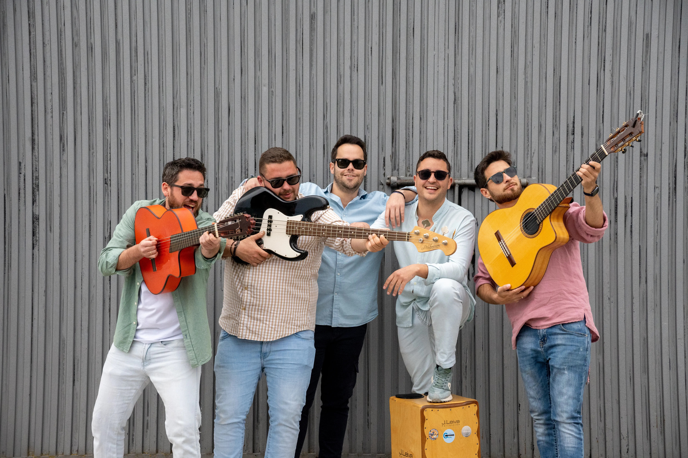

# Grupo Zambra 2.0 - Landing Page

Landing page profesional para el grupo musical **Grupo Zambra 2.0**, desarrollada con React, Vite y Tailwind CSS.

## 🚀 Características

- **Diseño responsivo** y moderno.
- Secciones: Inicio, Sobre Nosotros, Galería (fotos y videos), Contacto.
- Componentes reutilizables con [Tailwind CSS](https://tailwindcss.com/) y utilidades personalizadas.
- Animaciones y efectos visuales.
- Integración con Instagram, teléfono y correo electrónico.
- Código organizado y fácil de mantener.

## 📸 Demo



## 📂 Estructura del proyecto

```bash
src
├── assets            # Archivos estáticos (imágenes, fuentes, etc.)
├── components        # Componentes reutilizables de React
├── layouts           # Plantillas de diseño para las páginas
├── pages             # Páginas de la aplicación
├── App.jsx           # Componente raíz de la aplicación
└── main.jsx          # Archivo de entrada de la aplicación
tailwind.config.js    # Configuración de Tailwind CSS
vite.config.js        # Configuración de Vite
```

## 🛠️ Instalación y ejecución

1. Clonar el repositorio
2. Instalar dependencias: `npm install`
3. Ejecutar el servidor de desarrollo: `npm run dev`
4. Abrir en el navegador: `http://localhost:5173`

## 📧 Contacto

Para más información o consultas, por favor contactar a través de las redes sociales de **Grupo Zambra 2.0** o enviar un correo electrónico a [info@grupozambra20.com](mailto:info@grupozambra20.com). sd
